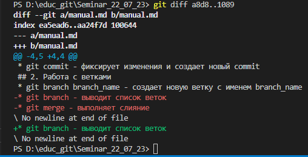
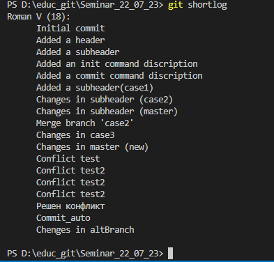
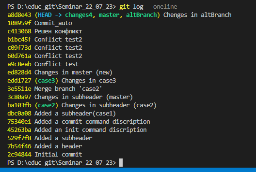
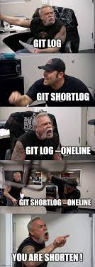
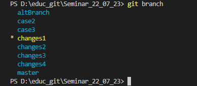

<h1 id="top-head" style="color:lightblue; background: black"> Git. Руководство пользователя</h1>

    
>What is Git?  
>>Git is everything...Go code!
 @Roman Volkov

## <h2 style="background:black">1. Основные команды 
* **git init** - инициализирует локальный репозиторий

 

* **git commit** - фиксирует изменения и создает новый commit
    -m - позволяет написать комментарий к коммиту
    -a - аналог команды add ~~(???Не применяется при создании файла???)~~
* **git add [*name*]** [.] - позволяет отметить изменения в файле [*name*] или в текущем каталоге [.] для внесения их в след. коммит
* **git rm [*name*]** - удаляет ненужный файл [*name*] из репозитория
* **git diff [*hash_code*]..[*hash_code*]** - позволяет сравнить два разных коммита

----

----

* **git log** - выводит список коммитов с информацией
    * **git shortlog** - упрощенная информация, а именно комментарии к коммитам
    ----

     

    ----
    
    * **git log --oneline** - упрощенная информация, а именно комментарии и также хэш-код коммитов
    

## <h2 style="background:black">2. Работа с ветками

----

* **git branch [*branch-name*]** - создает новую ветку с именем branch_name
* **git branch** - выводит список веток
* **git branch -d [*branch-name*]** - удаление ветки, только тогда, когда эта ветка влита в другую и они совмещены
      -D - форсированное удаление ветки 

----

* **git merge** - выполняет слияние

## <h2 style="background:black">3. Настройка 
* **git config** - утилита для изменения конфигурации GIT. Есть 3 уровня:
      1. **git config --system**  -  работают для всех пользователей и репозиториев. [path]/etc/gitconfig
      2. **git config --global**  -  работают для одного пользователя. ~/.gitconfig или ~/.config/git/config
      3. **git config --local**   -  работают для выбранного репозитория. .git/config
      4. **git config --global core.editor [path]** - использует текстовый редактор или IDE по указанному пути до .exe файла

* **git config --list** - показывает используемые настройки
* **git config [key]** - позволяет узнать что записано в конкретном свойстве, где, например, [key] = color.ui
* **git config --global init.defaultBranch [*name*]** - выбор ветки по умолчанию для конкретного юзера. Позволяет команде git init создавать репозиторий с веткой по умолчанию [*name*]
    * **git config --global color.branch [auto, false, true]** - позволяет включить, отключить или установить дефолтные значения цвета для вывода команды git branch
    * **git config --global color.branch.current "[color]"** - позволяет установить цвет для текущей ветки в выводе команды git branch
 

* **git --help** - выводит общую документацию по git
* **git show [*hash_code*]** - показывает важную информацию и изменения конкретного коммита
* **git checkout [*hash_code*]** - позволяет переключаться между коммитами
* **git checkout [*branch-name*]** - позволяет переключаться между ветками

## <h2 style="background:black">Важные заметки</h2>
* Если HEAD находится в состоянии detached(отсоединенной), например, если перейти на конкретный коммит, и закоммитить внесенные изменения в таком состоянии, то посмотреть все произведенные действия можно в .git/logs/HEAD конкретного репозитория

##  <h2 style="background:black">Работа с удаленными(онлайн) репозиториями </h2>
* **git clone [*url*]** - клонирование репозитория в текущий каталог
* **git remote** - выводит список текущий удаленных(онлайн) репозиториев
* **git remote add [*name*] [*url*]** - добавляет удаленный(онлайн) репозиторий
* **git push [*remote-name*] [*branch-name*]** - команда для отправки изменений на сервер
* **git pull** - извлекает и объединяет данные сервера и локальная версия

----

<h2 style="color: lightblue; background: black">Links</h2>

[Return to the main header](#top-head)

----

